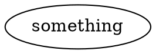
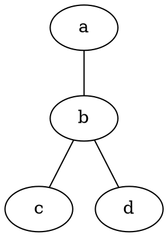
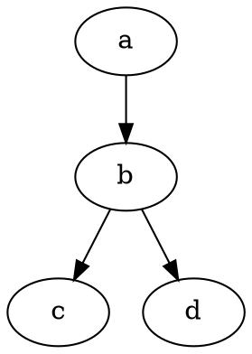
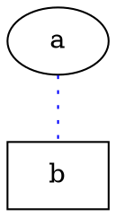
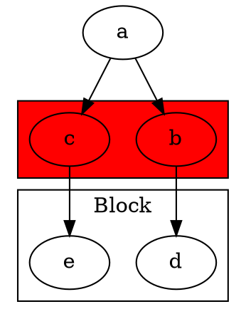

+++
title = "Graphviz"
author = ["System Administrator"]
draft = false
+++

## Dot lang. {#dot-lang-dot}




### indirected {#indirected}




### directed {#directed}




### attrs {#attrs}




### subgraph {#subgraph}




## Use {#use}


### in Shell {#in-shell}

```sh
dot -Tpdf filename.dot > filename.pdf
```